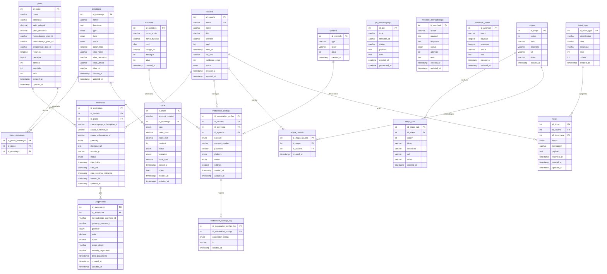

# DER - iavest01

## Diagrama de Entidade-Relacionamento


```mermaid
erDiagram
    usuario {
        int id_usuario PK
        varchar email UK
        varchar nome
        varchar ddd
        varchar telefone
        int hash
        timestamp hash_at
        varchar cpf_cnpj
        int validacao_email
        enum status
        timestamp created_at
        timestamp updated_at
    }

    corretora {
        int id_corretora PK
        varchar razao_social
        varchar nome_fantasia
        char cnpj
        varchar codigo_b3
        int destaque
        int ativo
        timestamp created_at
    }

    symbols {
        int id_symbols PK
        varchar type
        varchar ticker
        int ativo
        timestamp created_at
    }

    estrategia {
        int id_estrategia PK
        varchar nome
        text descricao
        enum type
        enum risco
        enum status
        longtext parametros
        varchar robo_nome
        varchar robo_descricao
        varchar robo_versao
        varchar robo_url
        timestamp created_at
        timestamp updated_at
    }

    metatrader_configs {
        int id_metatrader_configs PK
        int id_usuario FK
        int id_corretora FK
        int id_symbols FK
        enum account
        varchar account_number
        varchar password
        enum platform
        enum status
        longtext settings
        timestamp created_at
        timestamp updated_at
    }

    metatrader_configs_log {
        int id_metatrader_configs_log PK
        int id_metatrader_configs FK
        enum connection_status
        varchar ip
        timestamp created_at
    }

    trade {
        int id_trade PK
        varchar account_number
        int id_estrategia FK
        enum type
        decimal index_start
        decimal index_exit
        int contract
        enum status
        enum operation
        decimal profit_loss
        timestamp closed_at
        text notes
        timestamp created_at
        timestamp updated_at
    }

    plano {
        int id_plano PK
        varchar nome
        varchar descricao
        decimal valor_original
        decimal valor_desconto
        varchar mercadopago_plan_id
        varchar mercadopago_plan_url
        varchar preapproval_plan_id
        longtext recursos
        tinyint destaque
        int contrato
        int esgotado
        int ativo
        timestamp created_at
        timestamp updated_at
    }

    plano_estrategia {
        int id_plano_estrategia PK
        int id_plano FK
        int id_estrategia FK
    }

    assinatura {
        int id_assinatura PK
        int id_usuario FK
        int id_plano FK
        varchar mercadopago_subscription_id
        varchar asaas_customer_id
        varchar asaas_subscription_id
        enum gateway
        text checkout_url
        varchar remote_ip
        enum status
        timestamp data_inicio
        timestamp data_fim
        timestamp data_proxima_cobranca
        timestamp created_at
        timestamp updated_at
    }

    pagamento {
        int id_pagamento PK
        int id_assinatura FK
        varchar mercadopago_payment_id
        varchar gateway_payment_id
        enum gateway
        decimal valor
        varchar status
        varchar status_detail
        varchar metodo_pagamento
        timestamp data_pagamento
        timestamp created_at
        timestamp updated_at
    }

    ipn_mercadopago {
        int id_ipn PK
        varchar topic
        varchar resource_id
        varchar status
        text payload
        text erro
        datetime created_at
        datetime processed_at
    }

    webhook_mercadopago {
        int id_webhook PK
        varchar action
        text payload
        text response
        enum status
        int attempts
        text erro
        timestamp created_at
        timestamp updated_at
    }

    webhook_asaas {
        int id_webhook PK
        varchar event
        longtext payload
        longtext response
        varchar status
        text erro
        timestamp created_at
        timestamp updated_at
    }

    etapa {
        int id_etapa PK
        int ordem
        varchar titulo
        varchar descricao
        varchar url
        varchar video
        timestamp created_at
    }

    etapa_sub {
        int id_etapa_sub PK
        int id_etapa FK
        int ordem
        varchar titulo
        varchar descricao
        varchar url
        varchar video
        timestamp created_at
    }

    etapa_usuario {
        int id_etapa_usuario PK
        int id_etapa FK
        int id_usuario FK
        timestamp created_at
    }

    ticket_type {
        int id_ticket_type PK
        varchar identificador
        varchar label
        varchar descricao
        int ativo
        int ordem
        timestamp created_at
    }

    ticket {
        int id_ticket PK
        int id_usuario FK
        int id_ticket_type FK
        enum status
        varchar mensagem
        text payload
        timestamp resolved_at
        timestamp created_at
        timestamp updated_at
    }

    usuario ||--o{ assinatura : "assina"
    plano ||--o{ assinatura : "possui"
    assinatura ||--o{ pagamento : "gera"
    usuario ||--o{ metatrader_configs : "configura"
    corretora ||--o{ metatrader_configs : "associada"
    symbols ||--o{ metatrader_configs : "define ativo"
    metatrader_configs ||--o{ metatrader_configs_log : "registra"
    plano ||--o{ plano_estrategia : "vincula"
    estrategia ||--o{ plano_estrategia : "vinculada"
    estrategia ||--o{ trade : "gera"
    etapa ||--o{ etapa_sub : "subdivide"
    etapa ||--o{ etapa_usuario : "concluida por"
    usuario ||--o{ etapa_usuario : "conclui"
    ticket_type ||--o{ ticket : "categoriza"
    usuario ||--o{ ticket : "abre"
```

## Relacionamentos (Foreign Keys)

| Tabela Origem | Coluna | Tabela Destino | Coluna Destino | Cardinalidade |
|---------------|--------|----------------|----------------|---------------|
| metatrader_configs | id_usuario | usuario | id_usuario | N:1 |
| metatrader_configs | id_corretora | corretora | id_corretora | N:1 |
| metatrader_configs | id_symbols | symbols | id_symbols | N:1 |
| metatrader_configs_log | id_metatrader_configs | metatrader_configs | id_metatrader_configs | N:1 |
| trade | id_estrategia | estrategia | id_estrategia | N:1 |
| assinatura | id_usuario | usuario | id_usuario | N:1 |
| assinatura | id_plano | plano | id_plano | N:1 |
| pagamento | id_assinatura | assinatura | id_assinatura | N:1 |
| plano_estrategia | id_plano | plano | id_plano | N:1 |
| plano_estrategia | id_estrategia | estrategia | id_estrategia | N:1 |
| etapa_sub | id_etapa | etapa | id_etapa | N:1 |
| etapa_usuario | id_etapa | etapa | id_etapa | N:1 |
| etapa_usuario | id_usuario | usuario | id_usuario | N:1 |
| ticket | id_usuario | usuario | id_usuario | N:1 |
| ticket | id_ticket_type | ticket_type | id_ticket_type | N:1 |

## Indices e Constraints

| Tabela | Tipo | Nome | Colunas |
|--------|------|------|---------|
| metatrader_configs | UNIQUE | unique_user_account | id_usuario, account_number |
| usuario | INDEX | idx_email | email |
| usuario | INDEX | idx_status | status |
| metatrader_configs | INDEX | idx_id_usuario | id_usuario |
| metatrader_configs | INDEX | idx_status | status |
| trade | INDEX | idx_id_estrategia | id_estrategia |
| trade | INDEX | idx_status | status |
| estrategia | INDEX | idx_status | status |
| estrategia | INDEX | idx_type | type |
| pagamento | INDEX | idx_assinatura | id_assinatura |
| pagamento | INDEX | idx_mp_payment | mercadopago_payment_id |
| pagamento | INDEX | idx_status | status |
| plano_estrategia | INDEX | idx_id_plano | id_plano |
| plano_estrategia | INDEX | idx_id_estrategia | id_estrategia |
| ticket | INDEX | idx_ticket_usuario | id_usuario |
| ticket | INDEX | idx_ticket_type | id_ticket_type |

## Resumo das Tabelas

### usuario (Tabela Central)
- Armazena dados de autenticacao e perfil dos usuarios
- Campos de recuperacao: `hash` (codigo numerico) e `hash_at` (validade)
- Validacao de email via `validacao_email`
- Status: `active`, `inactive`, `suspended`

### corretora
- Cadastro de corretoras de valores
- Dados: razao social, nome fantasia, CNPJ, codigo B3
- Flags: `destaque` e `ativo`

### symbols
- Cadastro de ativos/tickers negociaveis (ex: WINM22, WDOJ22)
- Tipo: `WIN` (default)
- Flag: `ativo`

### estrategia
- Define estrategias de trading
- Tipos: `scalping`, `day_trading`, `swing_trading`, `position_trading`, `algorithmic`
- Niveis de risco: `low`, `medium`, `high`
- Status: `active`, `inactive`, `testing`
- Dados do robo associado: `robo_nome`, `robo_descricao`, `robo_versao`, `robo_url`

### metatrader_configs
- Configuracoes de conexao com MetaTrader 4/5
- Vinculada a usuario, corretora e symbols
- Tipo de conta: `DEMO`, `REAL`
- Platform: `MT4`, `MT5`
- Status: `active`, `inactive`, `error`
- UNIQUE: combinacao de `id_usuario` + `account_number`

### metatrader_configs_log
- Log de conexoes do MetaTrader
- Connection status: `connected`, `disconnected`, `error`
- Registra IP da conexao

### trade
- Registra operacoes de compra/venda
- Vinculado por `account_number` e `id_estrategia`
- Type: `buy`, `sell`
- Status: `open`, `closed`
- Operation: `profit`, `loss`

### plano
- Planos de assinatura disponiveis
- Valores: original e com desconto
- Integracao com Mercado Pago via `mercadopago_plan_id` e `preapproval_plan_id`
- Flag `esgotado`: indica que o plano nao aceita novas assinaturas

### plano_estrategia
- Tabela associativa entre planos e estrategias
- Define quais estrategias estao disponiveis em cada plano

### assinatura
- Assinaturas dos usuarios aos planos
- Status: `pending`, `active`, `paused`, `cancelled`
- Integracao com Mercado Pago e Asaas via campos especificos de cada gateway
- Campo `gateway`: `mercadopago` ou `asaas`

### pagamento
- Pagamentos vinculados a assinaturas
- Suporte a multiplos gateways: `mercadopago` e `asaas`
- `gateway_payment_id`: ID do pagamento no gateway correspondente

### ipn_mercadopago
- Armazena notificacoes IPN recebidas do Mercado Pago
- Topic: `payment`, `merchant_order`, `chargebacks`
- Status: `pending`, `processed`, `error`

### webhook_mercadopago
- Armazena webhooks recebidos do Mercado Pago
- Status: `processing`, `finished`, `error`
- Controle de tentativas via `attempts`

### webhook_asaas
- Armazena webhooks recebidos do Asaas
- Status: `processing`, `finished`, `error`

### etapa
- Etapas de onboarding/tutorial para os usuarios
- Campos: `ordem` (sequencia), `titulo`, `descricao`, `url` (link), `video`

### etapa_sub
- Sub-etapas vinculadas a uma etapa principal
- Mesma estrutura da etapa: `ordem`, `titulo`, `descricao`, `url`, `video`

### etapa_usuario
- Tabela associativa que registra quais etapas cada usuario concluiu

### ticket_type
- Categorias de tickets de suporte
- Campos: `identificador` (slug), `label` (rotulo), `descricao`, `ativo`, `ordem` (sequencia de exibicao)

### ticket
- Tickets de suporte abertos pelos usuarios
- Vinculado a usuario e ticket_type
- Status: `aberto`, `em_analise`, `aguardando_usuario`, `resolvido`, `fechado`
- Campo `mensagem` com texto padrao informando que interacao ocorre por email
- `payload` para dados adicionais, `resolved_at` para data de resolucao

## Fluxo de Dados

```
usuario
   |
   +---> metatrader_configs ---> metatrader_configs_log
   |         |
   |         +---> corretora
   |         +---> symbols
   |
   +---> assinatura ---> pagamento
   |         |
   |         +---> plano ---> plano_estrategia ---> estrategia ---> trade
   |
   +---> etapa_usuario ---> etapa ---> etapa_sub
   |
   +---> ticket ---> ticket_type
```

1. Usuario configura conexao MetaTrader vinculada a uma corretora e um ativo (symbol)
2. Estrategias geram trades identificados por account_number
3. Usuario assina planos que dao acesso a estrategias via plano_estrategia
4. Assinaturas geram pagamentos via Mercado Pago ou Asaas
